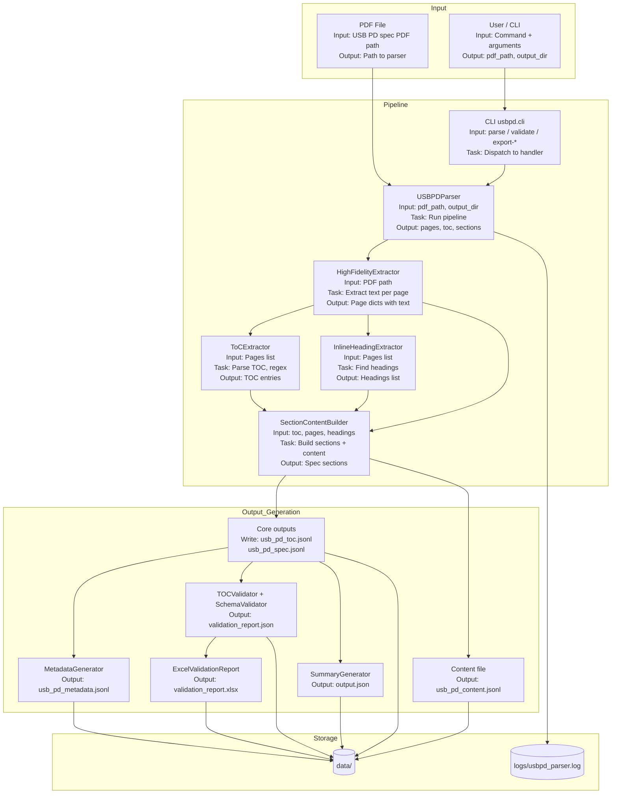

# USB PD Parser – System Architecture

This document describes the high-level architecture and component-level details of the USB Power Delivery Specification Parser, following the same structure as the sample project (e.g. Face Recognition): **Inputs**, **Processing**, and **Outputs** for each major part.

> **Viewing the diagrams**  
> IntelliJ’s built-in Markdown preview **does not render Mermaid**. To see the diagrams:
> - **GitHub**: Open this repo on GitHub and view the `.md` file; Mermaid renders there.
> - **IntelliJ**: Install a Mermaid plugin (e.g. *Mermaid* or *Markdown Preview Mermaid Support*) from *Settings → Plugins*.
> - **Browser**: Copy the `mermaid` code block into [mermaid.live](https://mermaid.live) and view or export as image.

---

## High-Level Architecture Diagram

---

## Component-Level Details

For each major component, the following table describes **Inputs**, **Processing**, and **Outputs**.

| Component | Location | Inputs | Processing | Outputs |
|-----------|----------|--------|------------|---------|
| **CLI** | `src/usbpd/cli.py` | User command (`parse`, `validate`, `excel`, `export-spec`, `export-metadata`, `export-validation-xlsx`), arguments (e.g. `pdf_path`, `--out`, `--toc`, `--chunks`) | Parse arguments, dispatch to the correct handler function | Runs `USBPDParser.run()` or the chosen generator/validator; prints result message |
| **USBPDParser** | `src/usb_pd_parser.py` | `pdf_path` (str), `output_dir` (str or Path), optional injectable extractors/builders | 1) Extract pages 2) Extract TOC 3) Extract inline headings 4) Build sections 5) Persist all outputs (core, content, metadata, validation, schema check, summary) | In-memory: `pages`, `toc`, `headings`, `sections`; on disk: all JSONL/JSON/Excel files in `output_dir` |
| **HighFidelityExtractor** | `src/extractors/high_fidelity_extractor.py` | PDF file path (str) | Open PDF with PyMuPDF; for each page extract text blocks; optional OCR for images; merge into one text per page | List of dicts: `[{ "page": 1, "text": "..." }, ...]` |
| **ToCExtractor** | `src/extractors/toc_extractor.py` | List of page dicts (from PDF extractor) | Parse TOC page range with regex; extract section IDs, titles, page numbers, levels; synthesize `parent_id` and `full_path` | List of TOC entries: `section_id`, `title`, `page`, `level`, `parent_id`, `full_path`, `doc_title`, `tags` |
| **InlineHeadingExtractor** | `src/extractors/inline_heading_extractor.py` | Dict with `"pages"` key (list of page dicts) | Scan body pages for numeric headings (e.g. `1.2.3 Title`); filter false positives (versions, abbreviations, figures/tables) | List of heading dicts: `section_id`, `title`, `page`, `level`, etc. |
| **SectionContentBuilder** | `src/extractors/section_builder.py` | `toc`, `pages`, `headings`, `doc_title` | For each heading, build a section record; extract section content from page text; filter false positives; optionally add unmapped pages | List of section dicts: `section_id`, `title`, `page`, `level`, `parent_id`, `full_path`, `content`, etc. |
| **Core outputs (TOC + Spec)** | `src/usb_pd_parser.py` (`_write_core_outputs`) | `toc` list, `sections` list, `output_dir` | Write JSONL: one JSON object per line | `usb_pd_toc.jsonl`, `usb_pd_spec.jsonl` |
| **Content file** | `src/usb_pd_parser.py` (`_generate_content_file`) | `sections` (with `content` field) | Filter sections that have non-empty content; write JSONL | `usb_pd_content.jsonl` |
| **MetadataGenerator** | `src/generators/metadata_generator.py` | Paths to `usb_pd_toc.jsonl` and `usb_pd_spec.jsonl` | Load both; build metadata records (e.g. doc title, counts) | `usb_pd_metadata.jsonl` |
| **TOCValidator** | `src/validator/toc_validator.py` | Paths to TOC JSONL and spec/chunks JSONL, report path | Compare TOC entries vs spec sections (title/page matching); compute quality score | `validation_report.json` |
| **SchemaValidator** | `src/utils/schema_validator.py` | JSONL file path, JSON schema path | Load schema and JSONL; validate each record against schema | Validation result (pass/fail), error list; no file output (used in pipeline) |
| **SummaryGenerator** | `src/generators/summary_generator.py` | Paths to TOC, spec, content, metadata, validation report; `pages_processed` count | Load files; compute stats (page coverage, section counts, completeness, key topics, validation status) | `output.json` (single JSON file) |
| **ExcelValidationReport** | `src/reports/excel_validation_report.py` | Path to `validation_report.json`, output XLSX path | Read validation JSON; build Excel workbook with formatting | `validation_report.xlsx` |

---

## Data Flow Summary

1. **User** runs: `python3 -m usbpd.cli parse <pdf_path> --out data`
2. **CLI** invokes **USBPDParser** with `pdf_path` and `output_dir`.
3. **Parser** uses **HighFidelityExtractor** to get **pages** from the PDF.
4. **ToCExtractor** and **InlineHeadingExtractor** consume **pages** and produce **TOC** and **headings**.
5. **SectionContentBuilder** takes **toc**, **pages**, and **headings** and produces **sections** (spec records with content).
6. **Parser** persists: core TOC/spec JSONL, content JSONL, metadata JSONL, validation (JSON + Excel), schema validation, and **output.json**.
7. **Logs** (when configured) go to `logs/usbpd_parser.log` with I/O metadata, timing, and errors.

---

## Logging

The project uses Python’s `logging` module. Logs include:

- **Input/output metadata** for key functions (e.g. counts of pages, TOC entries, sections).
- **Object sizes** where relevant (e.g. content length, list lengths).
- **Execution time** for major steps (when enhanced via the central logger).
- **Exceptions and errors** (e.g. file write failures, validation errors).

See `src/utils/logger_config.py` for central configuration.

**How logging improves reliability and tracking:** Logs give a repeatable record of each run (inputs, sizes, timings, errors). When something fails, you can inspect the log to see which step failed and what the data looked like. For interviews, you can walk through a sample log to explain the pipeline and discuss where time or memory might be spent.

### Time and space complexity (observations)

| Step | Time | Space |
|------|------|--------|
| PDF extraction | O(P) where P = number of pages | O(total text length) |
| TOC extraction | O(pages in TOC range) | O(number of TOC entries) |
| Inline headings | O(P × avg page length) | O(number of headings) |
| Section build | O(H × avg section content length) | O(sections + page text map) |
| Persist outputs | O(sections + toc) for JSONL writes | O(1) per file |

These are implementation-dependent; the log file records actual timings (e.g. `time_sec=...`) for the run.
