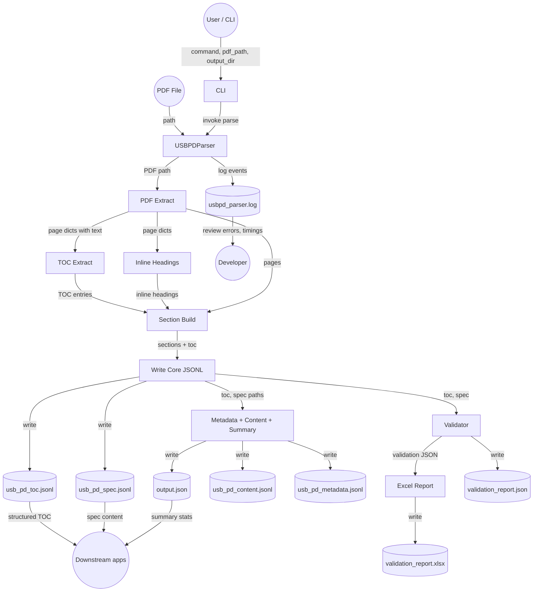

# USB PD Parser – Data Flow Diagram (Component Diagram)

This document shows the **data flow** between components of the USB PD Parser, in the same style as the sample project (e.g. Face Recognition): processes, labeled data flows, data stores, and external entities that consume outputs.

> **Viewing the diagram**  
> IntelliJ does not render Mermaid by default. View this file on **GitHub**, use a **Mermaid plugin** in IntelliJ, or paste the code block into [mermaid.live](https://mermaid.live).

---

## Data Flow Diagram (DFD)

---

## Flow Descriptions

| Flow label | From → To | Description |
|------------|-----------|-------------|
| command, pdf_path, output_dir | User → CLI | User runs e.g. `parse <pdf> --out data` |
| invoke parse | CLI → USBPDParser | CLI calls the parser with arguments |
| PDF path | Parser → PDF Extract | Path to the USB PD spec PDF |
| page dicts with text | PDF Extract → TOC Extract | List of `{page, text}` per page |
| page dicts | PDF Extract → Inline Headings | Same page list for heading scan |
| TOC entries | TOC Extract → Section Build | section_id, title, page, level, etc. |
| inline headings | Inline Headings → Section Build | Numeric headings from body |
| pages | PDF Extract → Section Build | Page text for content extraction |
| sections + toc | Section Build → Write Core JSONL | In-memory data to persist |
| toc, spec paths | Core → Metadata + Content + Summary | Paths to generated files |
| toc, spec | Core → Validator | TOC vs spec comparison |
| validation JSON | Validator → Excel Report | validation_report.json |
| log events | Parser → usbpd_parser.log | Timings, I/O metadata, errors |
| write | Processes → Data stores | Each process writes its output file(s) |
| review errors, timings | Log → Developer | Developer uses log for debugging |
| structured TOC / spec content / summary stats | Data stores → Downstream apps | Outputs consumed by other tools or users |

---

## Component Summary

- **Processes (rectangles):** CLI, USBPDParser, PDF Extract, TOC Extract, Inline Headings, Section Build, Write Core JSONL, Metadata/Content/Summary generators, Validator, Excel Report.
- **Data stores (cylinders):** All JSONL/JSON/Excel outputs and the log file.
- **External entities (double circles):** User/CLI (input), Developer (consumes log), Downstream apps (consume TOC, spec, summary).

For **inputs, processing, and outputs** of each component in detail, see [architecture.md](architecture.md).
